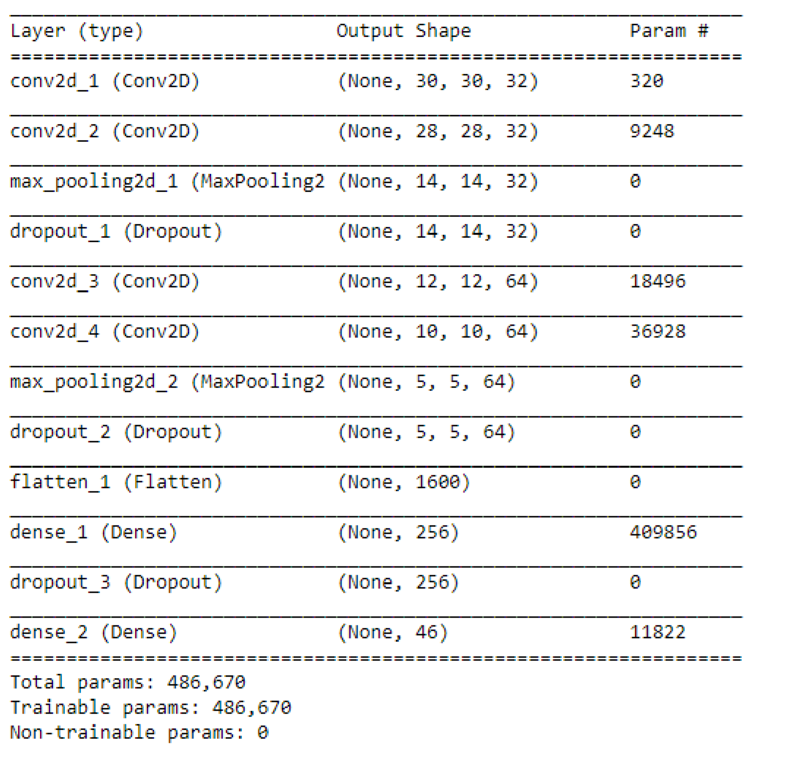
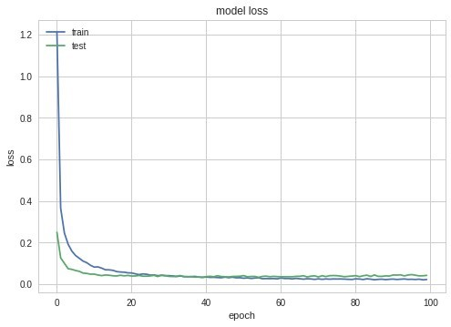
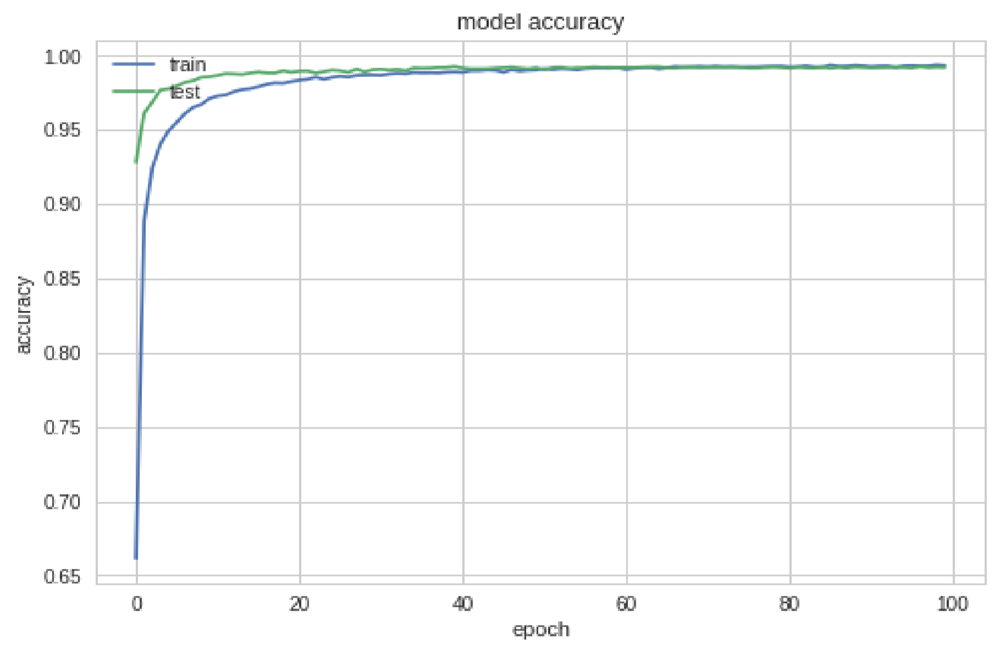
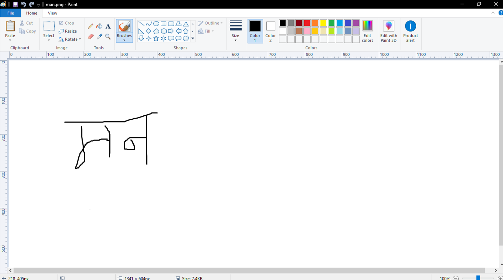
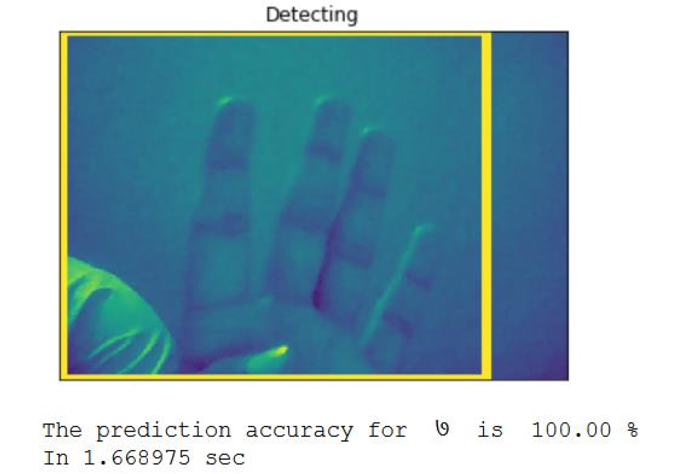
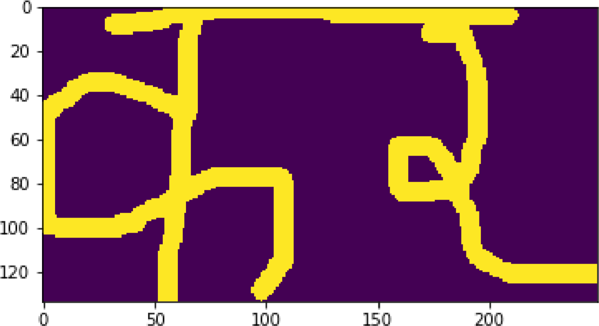
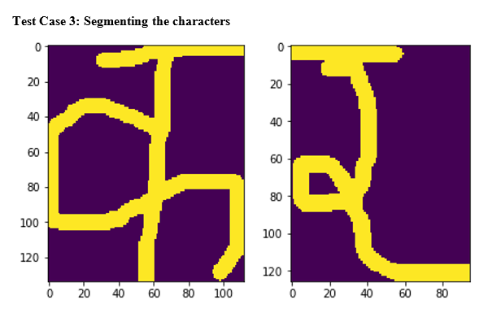
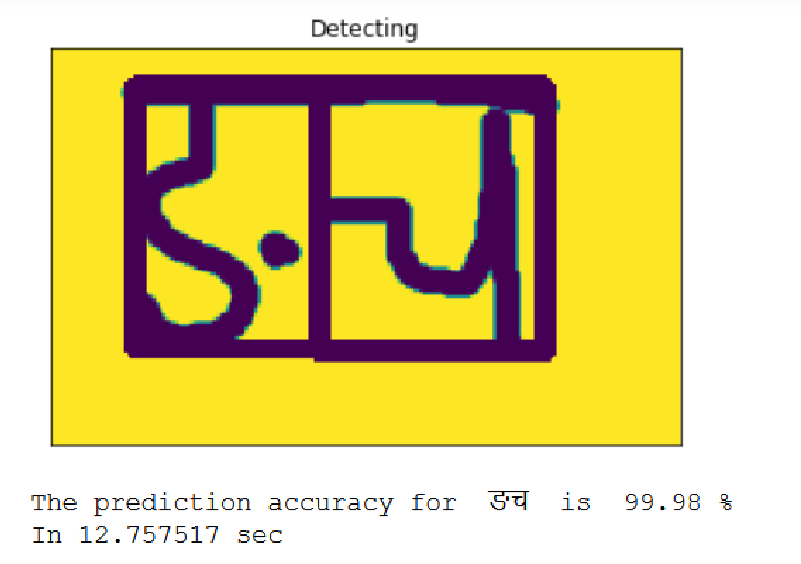

# Devanagari-Character-Word-Recognition
This is the final project for BSC.CSIT 7th semester.

# Devanagari-Character-Recognition
This is the final project of 7th semester BSC.CSIT.
<h1 align = 'center'>Introduction</h1>
Devanagari is the national font of Nepal and is used widely throughout the India also. It contains 10 numerals(०, १, २, ३, ४, ५, ६, ७, ८, ९) and 36 consonants (क, ख, ग, घ, ङ, च, छ, ज, झ, ञ, ट, ठ, ड, ढ, ण, त, थ, द, ध,न, प,फ, ब, भ, म, य, र, ल, व, श, ष, स, ह, क्ष, त्र, ज्ञ). Some consonants are complex and made by combine some other. However, throughout this project i considered them as single character.

The required dataset is publicly available on the <a href = 'https://web.archive.org/web/20160307001701/http://cvresearchnepal.com/wordpress/dhcd/'> link.</a> 

<h1 align = 'center'> Implementation </h1>
For this project i am using python 3.6 on anaconda. More importantly i am running it on Jupyter Notebook sometimes but <strong>Google Colab</strong> is what is used most. For model train/test, Colab is used. For real world image recogniton, i used my Intel I5 with 8gb RAM. The dependencies and libraries i used are: 
Python 3.6 
Numpy 
Matplotlib 
OpenCv 
Keras  

<h3>For better project information start with <a href = "https://github.com/q-viper/Devanagari-Character-Word-Recognition/blob/master/Proj_demonstration.ipynb">Project Demonstration</a>. </h3> 
<h3> Some snaps</h3>

* Model

* Loss

* Accuracy

* Image testing

* False prediction

* Image Cropping (ROI)

* Eliminating top

* Segmenting

* Localization

* Detection

